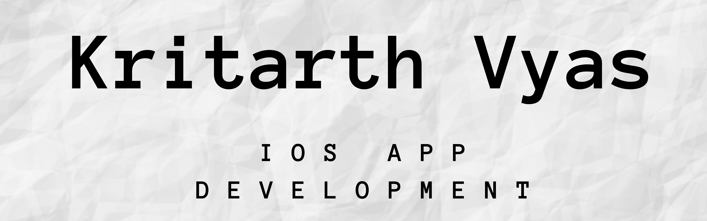

#  MessageX
## Overview

An internet based messaging iOS app similar to WhatsApp, enabling users to send/receive messages using Firebase Firestore to store and retrieve messages from the cloud using cocoapods and Swift component Table View.

## Live Demo
#### MessageX Live Demo

## Learning Objectives

* Integrating third party libraries into the app using Cocoapods and Swift Package Manager.
* Using Firebase Authentication. Storing data in the cloud using Firebase Firestore.
* Querying and sorting the Firebase database.
* Working with UITableViews.
* Creating custom views using .xib files.
* Creating direct Segues for navigation.

>This project is inspired from The App Brewery's Complete App Development Bootcamp - Flash Chat Project.

